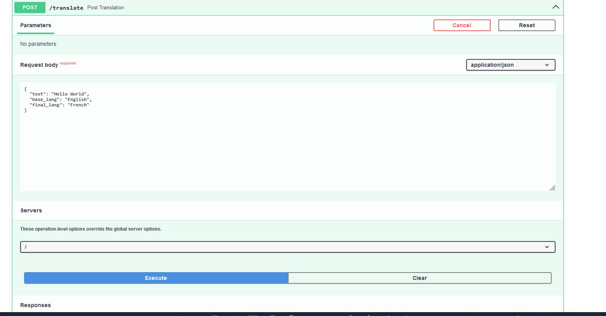

  
  This project is an API that uses deep learning for text translation.
The deep learning model used is the pre-trained model "t5-small" 

the api gets a text a base laguage and a final language as shown bellow:

  After this the api generates an id for the transalation and stores it in a database
by passing this id in the results route the translated text is shown:
